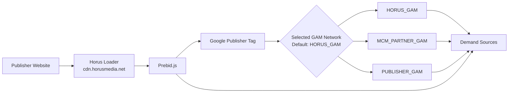
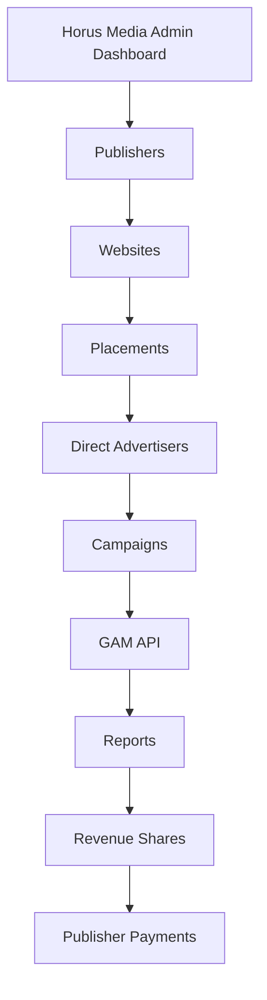

# Architecture

## System boundaries

Horus Media Platform is the control plane. It stores operational configuration,
connector metadata, and aggregated reporting. It never sits in the advertising
request path.

`DIRECT_NATIVE_ONLY` branches from loader configuration to configured native
connectors, and `PAUSED` prevents slot activation. They are omitted above to
keep the required GAM path legible.

## Control-plane workflow

This diagram is a capability sequence, not a claim that all modules exist in
the foundation release.

## Runtime components

- `app.horusmedia.net`: Laravel control plane and dashboard
- `cdn.horusmedia.net`: versioned loader, browser bundles, and published
  configuration artifacts
- MySQL: transactional control-plane data, database sessions, cache, queue,
  audit log, and aggregated reporting in later phases
- cron: Laravel scheduler once per minute
- browser: Prebid.js auctions, GPT setup, and direct advertising requests
- GAM and external networks: serving and source reporting systems

## Configuration publication

A later release will publish immutable, cacheable configuration snapshots to
the CDN. The loader resolves the current snapshot by stable site key. Publication
must be atomic, versioned, idempotent, auditable, and support dry-run for every
external write.

## Hostinger constraints

There is no production dependency on Docker, Redis, Supervisor, WebSockets,
permanent workers, or a Node.js runtime. Composer dependencies and Vite assets
are prepared before upload. Cron invokes the scheduler; scheduled database queue
work drains with `--stop-when-empty`.
