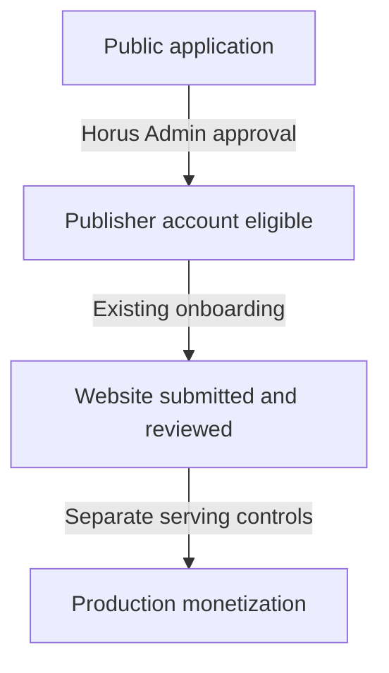
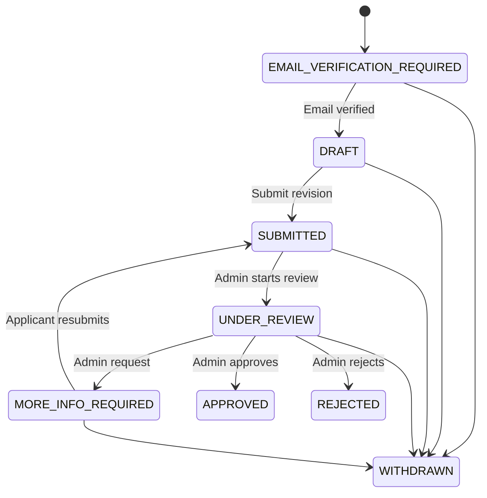

# Public Publisher Applications

## Product boundary

The public Publisher entry point is `/register/publisher` and is controlled by
`PUBLIC_PUBLISHER_REGISTRATION_ENABLED`. Disabling the switch prevents only new
public applications. It does not disable sign-in, invitations, password reset,
email verification, or an existing applicant's application-only portal.

These are four separate decisions:

Application approval does not create a Site, publish static configuration,
connect GAM, enable Prebid or Direct JS, bind finance, or activate ad serving.

## Identity and access boundary

Registration creates the canonical Publisher `Organization`, `Publisher`, and
`User`, but the Organization and Publisher remain `PENDING`. The user receives
no role. The normal `active` middleware therefore continues to deny every
operational Control Plane route.

The existing Laravel authentication backend may authenticate that user only
when a matching `PublisherApplication` exists for the same user and
organization. A separate applicant middleware exposes only:

- application status;
- email verification;
- save/resume of allowed application evidence;
- submit or resubmit;
- withdrawal;
- logout and existing password recovery.

There is no second password database or weak parallel authentication system.
Rejected and withdrawn applicants remain application-only. Approval atomically
activates the existing canonical Publisher and Organization, assigns the system
`PUBLISHER_ADMIN` role once, and hands the user to the existing seven-step
Publisher onboarding flow.

## Application lifecycle

Transitions are allowlisted in `PublisherApplicationStatus` and enforced both
by the lifecycle service and model. The first submission timestamp cannot be
rewritten. Submitted revisions and lifecycle events are append-only.

## Evidence and duplicate protection

The initial screen collects only contact name, work email, password, Publisher
name, and primary domain. Subsequent evidence reuses versioned Task 24
`PublisherQualityProfile` records; it does not introduce another traffic or
content-quality model. Each submission snapshots the exact profile and identity
evidence with a SHA-256 hash.

Domains use the existing strict `DomainNormalizer`, including lower-casing,
URL-host extraction, trailing-dot handling, and IDN conversion where the PHP
Intl extension is available. A unique live domain-claim row protects concurrent
applications. Existing Publisher business domains and Site domains are checked
without disclosing who owns them. Rejected or withdrawn claims are released,
while historical application evidence remains.

## Admin review and THOTH

`Admin → Publishers → Applications` requires the internal Horus boundary and
explicit `publisher_applications.view` or `publisher_applications.review`
permissions. Review start, information request, approval, and rejection append
lifecycle and audit evidence. Information requests and rejections require a
reason. Approval is transactionally locked and idempotent.

The existing THOTH Publisher Quality Advisor may analyze the canonical quality
profile from the application review screen. THOTH still writes advisory runs
only. It cannot transition `PublisherApplication`, and the legacy Publisher
quality-decision and account-status controls refuse to activate an unapproved
public application.

Applicant status notifications use the existing Account notification channel.
The scheduled notification email command permits this narrowly scoped channel
for a legitimate application-only identity even though its Organization is not
yet active.

## Operations

Production defaults public registration to disabled. Before enabling it:

1. confirm SMTP and signed verification links use the public application URL;
2. seed the current identity permissions and assign review responsibility;
3. verify registration and submission rate limits;
4. verify the Admin queue and notification delivery;
5. test rejection, more-information, approval, and withdrawal with non-production data;
6. confirm approval creates no Site or static-delivery item.
