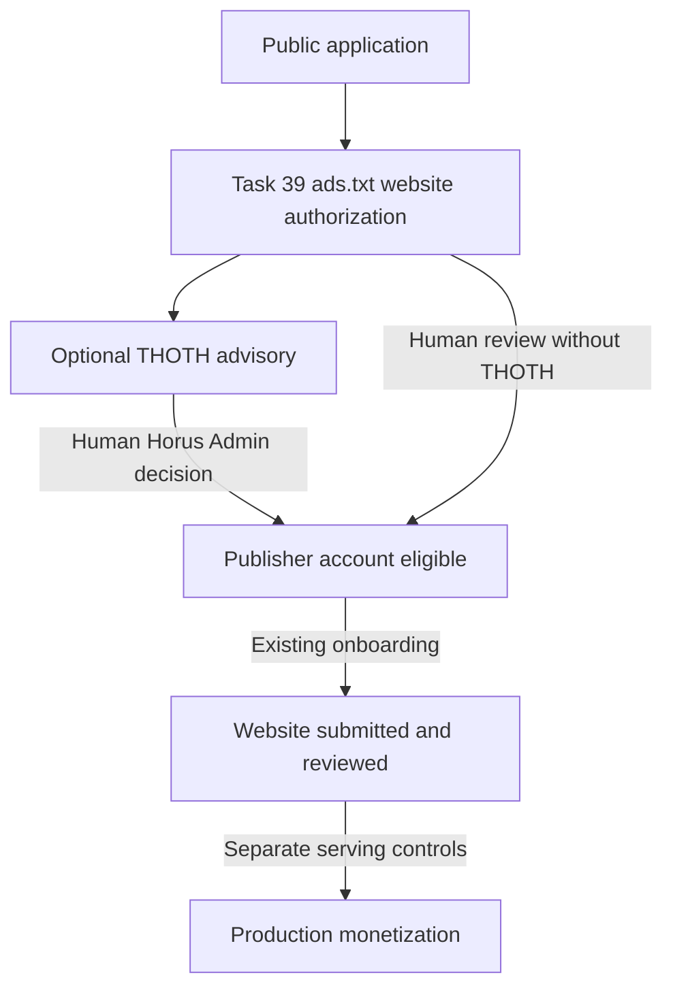
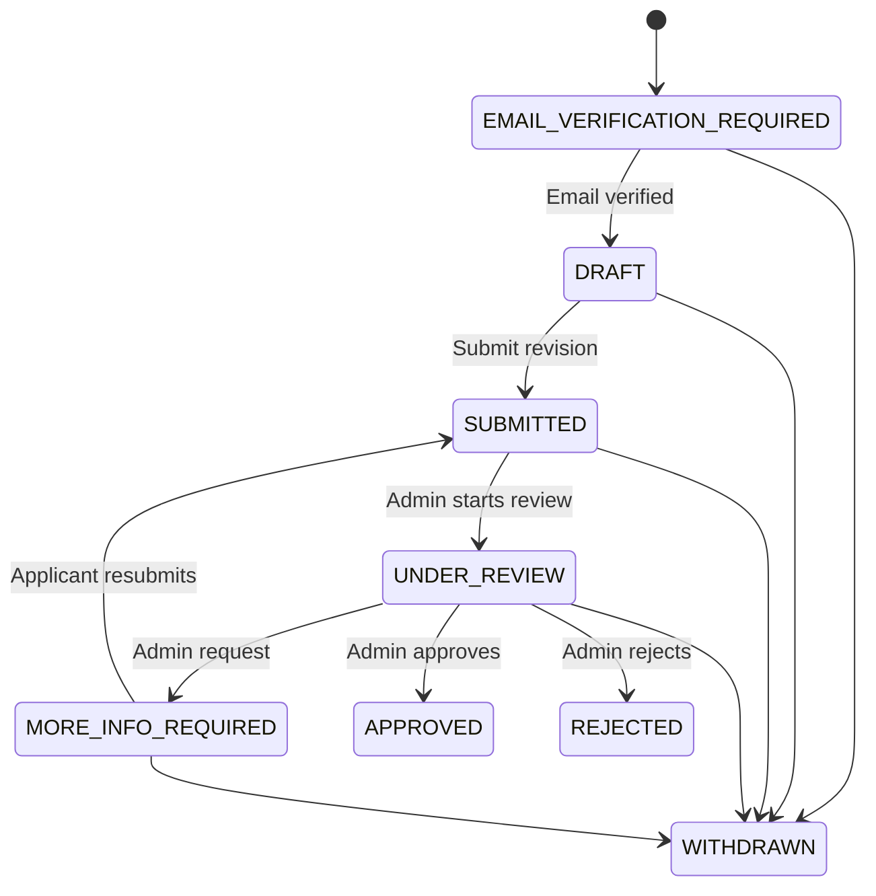

# Public Publisher Applications

## Product boundary

The public Publisher entry point is `/register/publisher` and is controlled by
`PUBLIC_PUBLISHER_REGISTRATION_ENABLED`. Disabling the switch prevents only new
public applications. It does not disable sign-in, invitations, password reset,
email verification, or an existing applicant's application-only portal.

These are separate decisions and evidence steps:



Application approval does not create a Site, publish static configuration,
connect GAM, enable Prebid or Direct JS, bind finance, or activate ad serving.
THOTH website verification and THOTH recommendations are not approvals.

## Identity and access boundary

Registration creates the canonical Publisher `Organization`, `Publisher`, and
`User`, but the Organization and Publisher remain `PENDING`. The user receives
no role. The normal `active` middleware therefore continues to deny every
operational Control Plane route.

The existing Laravel authentication backend may authenticate that user only
when a matching `PublisherApplication` exists for the same user and
organization. A separate applicant middleware exposes only:

- application status;
- email verification;
- save/resume of allowed application evidence;
- submit or resubmit;
- withdrawal;
- logout and existing password recovery.

There is no second password database or weak parallel authentication system.
Rejected and withdrawn applicants remain application-only. Approval atomically
activates the existing canonical Publisher and Organization, assigns the system
`PUBLISHER_ADMIN` role once, and hands the user to the existing seven-step
Publisher onboarding flow.

## Application lifecycle



Transitions are allowlisted in `PublisherApplicationStatus` and enforced both
by the lifecycle service and model. The first submission timestamp cannot be
rewritten. Submitted revisions and lifecycle events are append-only.

THOTH pre-approval review is deliberately narrower than the lifecycle: it may
run only in `SUBMITTED`, `UNDER_REVIEW`, or `MORE_INFO_REQUIRED`. It cannot run
for draft, withdrawn, approved, or rejected applications and cannot transition
any lifecycle state.

## Evidence and duplicate protection

The initial screen collects only contact name, work email, password, Publisher
name, and primary domain. Subsequent evidence reuses versioned Task 24
`PublisherQualityProfile` records; it does not introduce another traffic or
content-quality model. Each submission snapshots the exact profile and identity
evidence with a SHA-256 hash.

Domains use the existing strict `DomainNormalizer`, including lower-casing,
URL-host extraction, trailing-dot handling, and IDN conversion where the PHP
Intl extension is available. A unique live domain-claim row protects concurrent
applications. Existing Publisher business domains and Site domains are checked
without disclosing who owns them. Rejected or withdrawn claims are released,
while historical application evidence remains.

Task 39 reserves one immutable HMP Publisher seller ID and one immutable HMS
Website seller ID for the application domain and verifies the two real Horus
`DIRECT` records in live ads.txt. This Task 39 result is the only pre-approval
website-fetch trust boundary used by THOTH. Merely entered domains, unverified
claims, rejected claims and arbitrary Admin-entered URLs are never crawled.

## Admin review and THOTH

`Admin → Publishers → Applications` requires the internal Horus boundary and
explicit `publisher_applications.view` or `publisher_applications.review`
permissions. Review start, information request, approval, and rejection append
lifecycle and audit evidence. Information requests and rejections require a
reason. Approval is transactionally locked and idempotent.

A user with the separate `publisher_quality.ai.run` permission sees **Run THOTH
Website Review** directly on Application Review. The action is served by:

```text
POST /admin/publishers/applications/{application}/thoth-review
```

The action reuses the current Task 24 `PublisherQualityProfile`, the canonical
`PublisherEvidenceCollector`, `PublisherQualityReviewService`, provider adapters,
strict output schema, immutable review runs and evidence hashing. It does not
create a Site or a second application-specific AI/profile model.

Before public HTML is fetched, the current Task 39 claim must be verified. A
verification older than `THOTH_APPLICATION_DOMAIN_VERIFICATION_FRESH_DAYS`
(default 7 days) is refreshed through the same canonical Task 39 ads.txt
verifier. That refresh consumes the already-reserved HMP/HMS references and
never calls seller-identity reservation. If either required record has
subsequently disappeared, website fetching is blocked without rejecting the
application.

Application evidence identifies `review_context=PUBLISHER_APPLICATION`, the
application/status, semantic website authorization result, verification source
and freshness, the canonical profile version, bounded public pages and evidence
gaps. HMP/HMS remain visible to Admin in the Domain / Authorization section but
are not unnecessarily sent to the AI provider.

Application Review displays four explicitly separated concerns:

1. **Domain / Authorization** — domain, HMP, HMS, ads.txt state and freshness.
2. **Public Website Evidence** — analyzed pages, collection time and gaps.
3. **THOTH AI Advisory** — recommendation, risk, confidence, findings, checks,
   provider/model and run time.
4. **Human Decision** — the only authoritative application actions.

Missing privacy/about/contact pages, timeouts, or even zero acceptable public
pages are evidence gaps rather than automatic rejection. When no public page is
available, THOTH can have declarations only and the Admin can continue manual
review.

THOTH remains an explicit Admin action; editing or resubmitting an application
does not automatically spend external AI calls. Provider or schema failure
creates only safe review failure evidence and leaves the application workflow
usable.

Applicant status notifications use the existing Account notification channel.
The scheduled notification email command permits this narrowly scoped channel
for a legitimate application-only identity even though its Organization is not
yet active.

## Operations

Production defaults public registration to disabled. Before enabling it:

1. confirm SMTP and signed verification links use the public application URL;
2. seed the current identity permissions and assign review responsibility;
3. verify registration and submission rate limits;
4. verify the Admin queue and notification delivery;
5. test rejection, more-information, approval, withdrawal, Task 39 verification,
   stale-verification refresh and THOTH safe failure with non-production data;
6. confirm approval and THOTH execution create no Site or static-delivery item;
7. confirm HMP/HMS remain unchanged across THOTH evidence collection.
