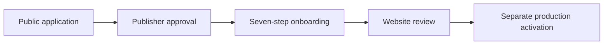

# Publisher Onboarding and Websites

## Scope

The module implements company/contact onboarding, encrypted payment profiles,
publisher contracts and private documents, websites, authorized domains,
ownership verification, placement planning, final submission, Horus Media
review, operational status controls, revenue-share controls, and append-oriented
history. It does not call GAM, Prebid bidders, native networks, or another
advertising API.

## Public application handoff

The optional public application flow is a gate before this seven-step process,
not a replacement for it:



An applicant has no onboarding permission or Publisher role while its
Organization remains `PENDING`. Admin approval atomically activates the existing
canonical account and assigns `PUBLISHER_ADMIN`, then sends that user to step 1.
No Site is created from the application domain. The domain is only application
and quality-review evidence until the user deliberately creates a website in
step 4. Existing Admin-created Publishers and invitation users bypass the public
application flow and remain backward compatible.

## Seven-step onboarding

1. Company and primary contact details.
2. Payment method and encrypted account/tax references.
3. Draft contract terms and revenue share.
4. First website; `HORUS_GAM` is assigned unconditionally.
5. Meta, text-file, DNS TXT, or later manual verification.
6. Placement planning only; no ad units are created.
7. Final submission into website review.

Verification state is review evidence, not a serving-mode eligibility rule. It
never prevents an administrator from choosing `HORUS_GAM`.

## Website lifecycle

Publisher submission moves `DRAFT`, `PENDING_VERIFICATION`, or `REJECTED` to
`PENDING_REVIEW`. Horus Media may approve or reject the review, activate an
approved site, suspend an approved/active site, restore a suspension to its
recorded prior state, or archive an ended website while retaining history.
Every transition appends `site_status_history` and an audit event.

Emergency pause transactionally selects `PAUSED`, increments configuration
version, appends serving-mode history, and suspends the site where applicable.
Reactivation never silently changes serving mode.

## Serving configuration

`sites.public_key` is stable and appears in the installation tag:

```html
<script async src="https://cdn.horusmedia.net/loader.js" data-horus-site="hm_PUBLIC_KEY"></script>
```

No network code or serving mode appears in the tag. `sites.serving_mode` and
`site_serving_settings.serving_mode` both default to `HORUS_GAM` and are updated
in one transaction. Each real change appends `serving_mode_changes` with the
previous/new modes, administrator, reason, time, and optional rollback link.

Website revenue share is inherited from the publisher's commercial agreement.
Publisher-facing website requests cannot override it; only the audited Horus
Media serving-control workflow can change the site revenue share. Changes to
publisher-visible Prebid or native-demand preferences increment the site's
configuration version for future loader configuration publication.

## Domain verification

- Meta tag: `horus-site-verification` token in the home page.
- Text file: token at `/.well-known/horus-verification.txt`.
- DNS TXT: `horus-site-verification=<token>` at `_horus-verify.<domain>`.
- Manual: explicit Horus administrator decision with an audited reason.

HTTP checks accept only valid public-domain targets, reject private/reserved
addresses, pin the request to the validated DNS answer when cURL is available,
disable redirects, enforce connection/response timeouts, and limit the response
body used for validation.

## Authorization

All publisher records carry `organization_id` and use the tenant global scope.
Publisher viewers can view sites and agreements but cannot mutate onboarding,
branding, payment data, or websites. Only Horus roles with `sites.review`,
`sites.serving.manage`, `contracts.manage`, or `publisher_payments.manage` can
perform their corresponding administrative actions. Internal notes and review
reasons are never rendered in publisher pages.
