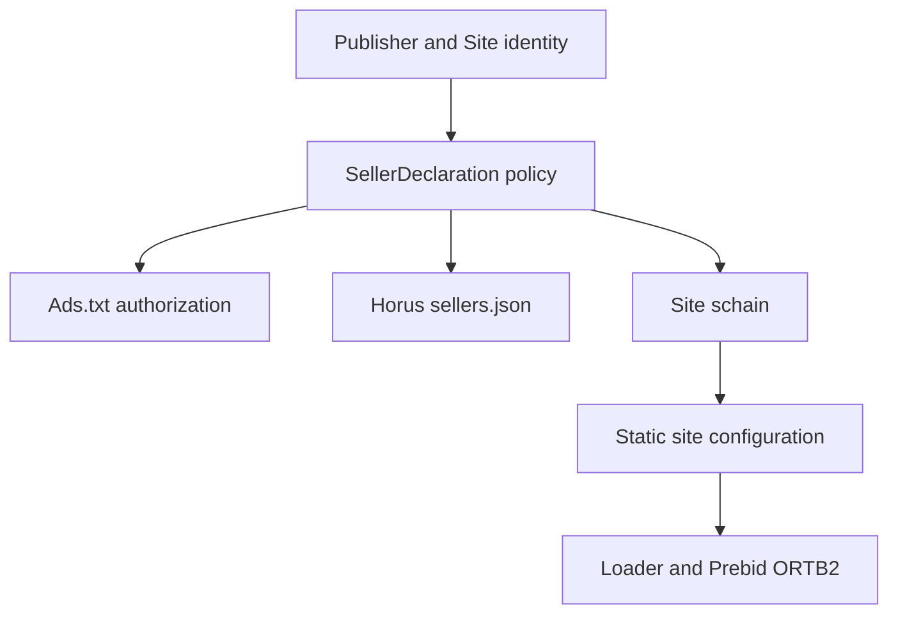

# Supply Chain Compliance Control Center

## Purpose and authority

This is the implementation and operations reference for the unified Horus
Ads.txt, sellers.json, and SupplyChain Object control plane. All three public
projections derive from the same `Publisher`, `Site`, and `SellerDeclaration`
identity. They are not independently editable stores.

The implementation was verified on 2026-08-09 against these primary sources:

- [sellers.json 1.0 final specification](https://iabtechlab.com/wp-content/uploads/2019/07/Sellers.json_Final.pdf)
- [SupplyChain Object 1.0 final specification](https://github.com/InteractiveAdvertisingBureau/openrtb/blob/main/supplychainobject.md)
- [ads.txt 1.1 final specification](https://iabtechlab.com/wp-content/uploads/2022/04/Ads.txt-1.1.pdf)
- [IAB Tech Lab SupplyChain validation test cases](https://iabtechlab.com/wp-content/uploads/2021/11/Supply-Chain-Validation-Test-Cases.pdf)
- [Prebid schain documentation](https://docs.prebid.org/dev-docs/modules/schain.html)
- [Prebid 10 first-party-data migration notes](https://docs.prebid.org/dev-docs/pb10-notes.html)

SupplyChain 1.1 was still in public comment through 2026-08-21 at the time of
implementation. It is not a final production authority. Horus therefore emits
the final 1.0 structure (`ver: "1.0"`, `hp: 1`) and must be reviewed again when
IAB Tech Lab publishes a later final version.

## One canonical flow



`SupplyChainInvariantService` is the shared policy boundary. A website must
resolve to exactly one active, publishable Horus seller ID before Horus adds
its own Ads.txt authorization or emits a schain node. `SupplyChainArtifactBuilder`
and `SiteConfigurationBuilder` consume this projection; neither reconstructs
identity from unrelated fields.

## Identity decisions

| Protocol field | Horus source and rule |
| --- | --- |
| sellers.json `seller_id` | Reviewed commercial seller ID from `SellerDeclaration`; 1–64 characters, no whitespace, comma, or control character. |
| sellers.json `seller_type` | Defined enum: `PUBLISHER`, `INTERMEDIARY`, or `BOTH`. |
| sellers.json `name` / `domain` | Public legal identity and normalized business domain. Omitted when `is_confidential: 1`. The internal identity remains stored for review. |
| Ads.txt Horus record | `SUPPLY_CHAIN_MANAGER_DOMAIN, seller_id, DIRECT` only when the selected seller type owns inventory (`PUBLISHER` or `BOTH`). External demand records keep their separately reviewed relationship. |
| schain `asi` | Normalized `SUPPLY_CHAIN_MANAGER_DOMAIN`; default `horusmedia.net`. This identifies the advertising system represented by the node. |
| schain `sid` | The same selected Horus `seller_id` published in sellers.json and authorized in Ads.txt where applicable. It is never a database ID. |
| schain `hp` | `1`, required for each 1.0 node and indicating involvement in payment flow. |
| schain `complete` | `1` for a resolved `PUBLISHER`/`BOTH` identity. `0` for `INTERMEDIARY`, because an upstream inventory-owner node is required but is not guessed. |
| schain node order | Inventory owner first, then each intermediary in transaction order, and the sender of the bid request last. Horus currently emits only its known node. Missing upstream nodes produce an incomplete chain and finding. |

An intermediary declaration does not cause Horus to invent a `DIRECT` or
`RESELLER` line. Account-specific upstream/downstream seller IDs require
commercial configuration. A missing or ambiguous seller identity omits the
entire client `supplyChain` object and records an actionable finding; ad serving
otherwise continues.

## Seller lifecycle

Publication status and identity review are separate enums:

- New declarations are `DISABLED` and `REVIEW_REQUIRED`.
- Structural edits—including seller ID, type, name, domain, confidentiality,
  or website scope—disable publication and reset review metadata. The paid
  publisher/entity is immutable; moving identity requires a new declaration.
- `VERIFIED` records can be activated. Activation queues a new durable static
  configuration publication for affected websites. Activation fails safely
  until that publisher has at least one website capable of carrying the
  publication trigger.
- `REJECTED` records are disabled automatically.
- Deactivation removes the seller from the next public artifact and removes
  its schain from affected site configurations.

Every create, update, review, activate, and deactivate action is stored in the
existing audit log. Confidential names and domains are replaced with
`[CONFIDENTIAL]` in audit values.

## sellers.json publication

The public, standards-required artifact is:

- `/sellers.json`

The static publisher also emits `/supply/sellers.json` as a byte-identical
compatibility alias. Both are served as `application/json`; the root path must
be exposed by the production advertising-system domain. The Admin preview is
generated from exactly the same builder and is returned with `private,
no-store`.

Example public entry:

```json
{
  "seller_id": "horus-publisher-1001",
  "seller_type": "PUBLISHER",
  "name": "Example Publishing Ltd",
  "domain": "example-publishing.com",
  "is_confidential": 0
}
```

Example confidential entry:

```json
{
  "seller_id": "horus-confidential-1002",
  "seller_type": "INTERMEDIARY",
  "is_confidential": 1
}
```

The complete artifact has `version: "1.0"`, a sorted `sellers` array, and
optional root `contact_email`, `contact_address`, and `identifiers` values from
safe central configuration. It has no internal primary keys, organization IDs,
reviewer data, credentials, notes, or timestamps. `SellersJsonValidator`
validates the full payload before JSON encoding or static publication.

Equivalent declarations collapse deterministically. A seller ID mapped to
different entities, types, confidentiality states, names, or domains is
excluded rather than choosing a winner. Disabled or incomplete declarations
are never emitted. Canonical JSON key ordering and the absence of generated
timestamps make an unchanged build byte-identical.

## Ads.txt relationship

For a website with an unambiguous active `PUBLISHER` or `BOTH` declaration,
the canonical Ads.txt projection contains a Horus authorization such as:

```text
OWNERDOMAIN=example-publishing.com
MANAGERDOMAIN=horusmedia.net
horusmedia.net, horus-publisher-1001, DIRECT
```

The seller ID in that line is the same value used by sellers.json and schain.
Managed external demand records continue to come from `DemandAdsTxtRecord` and
its approved account/site mapping. Exact duplicates collapse; conflicting
relationship or authority lines are excluded rather than guessed. Live Ads.txt
verification remains documented in `ADS_TXT_COMPLIANCE.md`.

## Static schain and Prebid runtime

A valid public site configuration contains only protocol-required values:

```json
{
  "supplyChain": {
    "schain": {
      "complete": 1,
      "ver": "1.0",
      "nodes": [
        {
          "asi": "horusmedia.net",
          "sid": "horus-publisher-1001",
          "hp": 1
        }
      ]
    }
  }
}
```

`SupplyChainObjectValidator` checks that generated nodes contain only `asi`,
`sid`, and `hp`, use a normalized domain, have unique identities, and respect
the 64-character `sid` limit. When no valid node exists, the `supplyChain` key
is omitted instead of exposing an empty or invented object.

The permanent Horus loader assigns this exact object to Prebid first-party data
at `ortb2.source.ext.schain` before requesting bids. This matches Prebid 10's
current configuration model and requires no publisher code change. Bid and
impression events remain in the browser/ad stack; no raw event is sent through
Laravel.

## Cross-validation findings

`SupplyChainComplianceService` compares the canonical network seller artifact,
each website's Ads.txt projection, and its schain. The Admin UI surfaces codes
including:

| Finding | Meaning and action |
| --- | --- |
| `SELLER_ID_CONFLICT` | One seller ID maps to different entities or public identities. Correct the declarations; nothing is published for that ID. |
| `DUPLICATE_SELLER_DECLARATION` | Equivalent declarations were safely collapsed. Remove redundant scope if it is not intentional. |
| `SELLER_DOMAIN_CONFLICT` | Seller domain differs from the publisher business domain. Confirm and correct the legal identity. |
| `SELLER_IDENTITY_INCOMPLETE` | ID, type, name, or domain is invalid/incomplete. Complete review before activation. |
| `ADS_TXT_UNKNOWN_HORUS_SELLER` | Ads.txt authorizes a Horus seller ID absent from the generated sellers.json. Correct the demand record or seller declaration. |
| `ADS_TXT_SELLER_TYPE_MISMATCH` | Ads.txt relationship conflicts with the declared seller type. Confirm the commercial role. |
| `ADS_TXT_SELLER_AUTHORIZATION_MISSING` | The selected site seller is not authorized by the canonical Ads.txt projection. |
| `SCHAIN_UNKNOWN_SELLER` | A schain node references an ID not published by sellers.json. |
| `SCHAIN_SELLER_REFERENCE_MISSING` | A selected seller has no valid generated schain node. |
| `SCHAIN_UPSTREAM_IDENTITY_REQUIRED` | Horus knows an intermediary node but lacks the inventory-owner node; chain remains incomplete. |
| `SITE_SELLER_MISSING` / `SITE_SELLER_CONFLICT` | The site has zero or multiple eligible seller IDs; no value is guessed. |

Health labels are computed from these findings. Operators cannot manually set
a green compliance badge.

## Control-plane routes and permissions

The Admin navigation is `Supply Chain & Compliance → Sellers`.

| Route | Permission | Purpose |
| --- | --- | --- |
| `GET /admin/compliance/sellers` | `supply_chain.sellers.view` | Network table, findings, and create form where permitted. |
| `GET /admin/compliance/sellers/artifact` | `supply_chain.sellers.view` | Exact private Admin preview of generated sellers.json. |
| `GET /admin/compliance/sellers/{seller}` | `supply_chain.sellers.view` | Declaration, sites, generated fragment, health, and history. |
| `POST /admin/compliance/sellers` | `supply_chain.sellers.manage` | Create a disabled declaration. |
| `PUT /admin/compliance/sellers/{seller}` | `supply_chain.sellers.manage` | Edit structural identity and return it to review. |
| `POST /admin/compliance/sellers/{seller}/review` | `supply_chain.sellers.review` | Record `VERIFIED`, `REJECTED`, or `REVIEW_REQUIRED`. |
| `PATCH .../{seller}/activate` / `deactivate` | `supply_chain.sellers.manage` | Change publication state and queue static output. |

Operations Admin and Ad Ops Admin receive view/manage/review. Finance Admin and
Support Agent receive read-only view. Super Admin retains all permissions.

Publisher Admin and Publisher Viewer continue to use
`publisher.ads_txt.view`; the renamed Supply Chain Compliance page now displays
only their own seller identity and per-site Ads.txt/sellers.json/schain health.
Confidential public fields stay redacted, and other publishers' declarations
are never queried into that view. Structural changes remain Admin-only.

## Static publication and operations

Seller activation, deactivation, review that changes active eligibility, or a
structural edit creates durable static publication work through
`SiteConfigPublisher`. Active affected websites receive a new configuration.
When a publisher has no active website, a paused production configuration is
queued where a site exists so global sellers.json changes still reach the
static snapshot without enabling ads.

Deployment must expose these files from the configured manager domain:

- `https://{manager-domain}/sellers.json`;
- `supply/sites/{siteKey}/ads.txt` and the domain alias used by the deployment;
- the existing versioned/static site configuration and permanent loader.

Production should verify response content types and ensure the publisher's
root `/ads.txt` delegates or serves the canonical Horus content according to
the Ads.txt runbook. The static origin's `_headers` rules set JSON for
sellers.json and text/plain for Ads.txt.

## Commercial configuration still required

The application deliberately does not invent any of these values:

- each publisher's verified legal name and business/owner domain;
- every Horus seller ID, paid entity, seller type, confidentiality choice, and
  publisher/site scope;
- upstream inventory-owner or additional intermediary node identifiers when
  Horus is not the complete path;
- external demand-system account IDs, `DIRECT`/`RESELLER` relationships, and
  optional certification authority IDs;
- production confirmation of `SUPPLY_CHAIN_MANAGER_DOMAIN`,
  `SUPPLY_CHAIN_CONTACT_EMAIL`, `SUPPLY_CHAIN_CONTACT_ADDRESS`, and optional
  `SUPPLY_CHAIN_TAG_ID`;
- any changes required by a future final SupplyChain specification after 1.0.

Domain validation is syntactic and normalized but does not bundle the Public
Suffix List. Compliance owners must confirm the actual registrable business
domain. External demand-provider reporting is outside this control center and
is intentionally not implemented.
